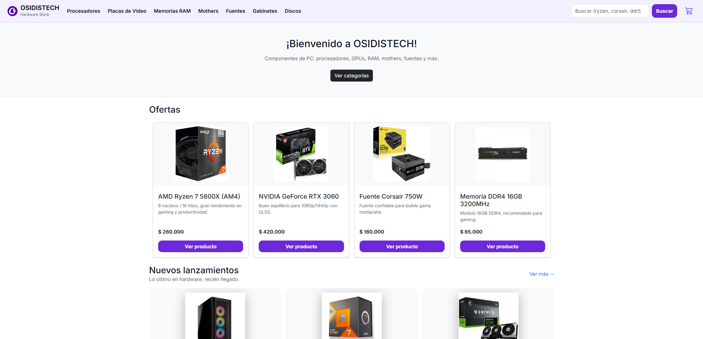
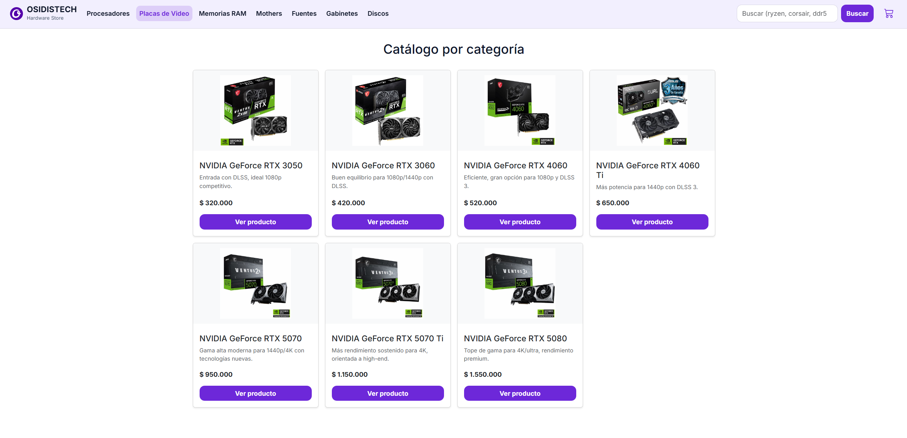
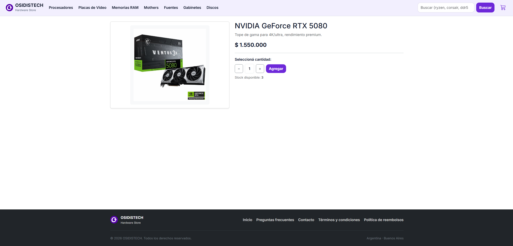
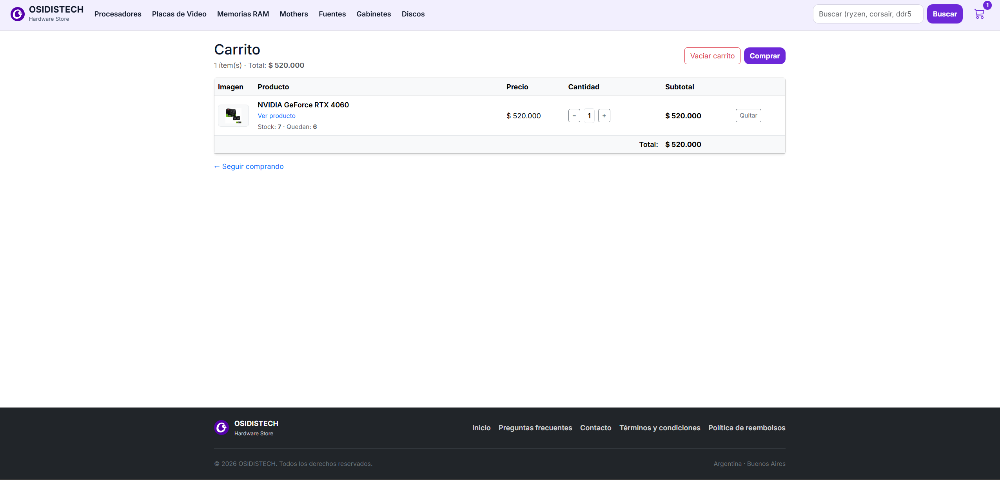
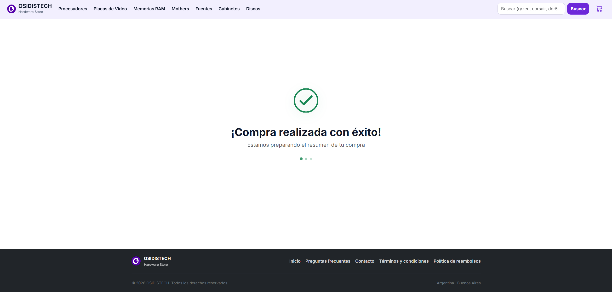
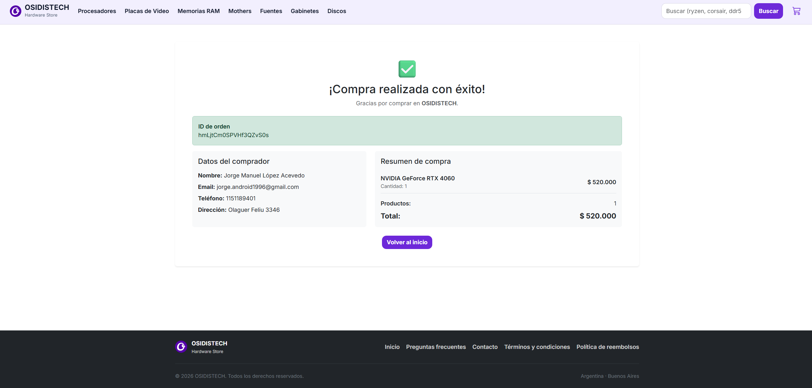

# 🖥️ OSIDISTECH – Hardware Store

Tienda online de hardware desarrollada con React, donde los usuarios pueden navegar productos, filtrarlos por categorías, buscarlos, agregarlos al carrito y finalizar la compra generando una orden almacenada en Firebase Firestore.

🔗 **Demo online:** https://osidistech.vercel.app/

---

## 📸 Capturas de pantalla

### Home



### Catálogo por categoría



### Detalle de producto



### Carrito



### Procesando compra



### Compra exitosa



---

## 📦 Características principales

- Catálogo de productos
- Navegación por categorías
- Buscador de productos con sugerencias en tiempo real
- Página de detalle del producto
- Carrito de compras con modificación de cantidades
- Validación de stock
- Formulario de checkout con validación de campos
- Generación de orden de compra en Firebase Firestore
- Página de compra exitosa con resumen
- Notificaciones Toast
- Deploy en Vercel

---

## 🛠️ Tecnologías y librerías utilizadas

- [React 18](https://react.dev/)
- [React Router DOM v6](https://reactrouter.com/)
- [Firebase / Firestore](https://firebase.google.com/)
- [Bootstrap 5](https://getbootstrap.com/)
- [Bootstrap Icons](https://icons.getbootstrap.com/)
- [Vite](https://vitejs.dev/)
- JavaScript ES6+

---

## ⚙️ Variables de entorno

El proyecto usa variables de entorno para las credenciales de Firebase. Antes de correr el proyecto localmente, creá un archivo `.env` en la raíz con las siguientes variables (ver `.env.example`):

```
VITE_FIREBASE_API_KEY=
VITE_FIREBASE_AUTH_DOMAIN=
VITE_FIREBASE_PROJECT_ID=
VITE_FIREBASE_STORAGE_BUCKET=
VITE_FIREBASE_MESSAGING_SENDER_ID=
VITE_FIREBASE_APP_ID=
VITE_FIREBASE_MEASUREMENT_ID=
```

---

## 📂 Estructura del proyecto

```
src
┣ components
┃ ┣ CartView.jsx
┃ ┣ CartWidget.jsx
┃ ┣ Categories.jsx
┃ ┣ CheckoutProcessing.jsx
┃ ┣ CheckoutSuccess.jsx
┃ ┣ Footer.jsx
┃ ┣ Home.jsx
┃ ┣ ItemCard.jsx
┃ ┣ ItemCount.jsx
┃ ┣ ItemDetail.jsx
┃ ┣ ItemDetailContainer.jsx
┃ ┣ ItemList.jsx
┃ ┣ ItemListContainer.jsx
┃ ┣ NavBar.jsx
┃ ┣ NotFound.jsx
┃ ┣ SearchResultsContainer.jsx
┃ ┗ Footer.jsx
┣ context
┃ ┗ CartContext.jsx
┣ firebase
┃ ┣ firebaseConfig.js
┃ ┣ firestore.js
┃ ┗ orders.js
┣ utils
┃ ┗ formatPrice.js
┣ assets
┃ ┣ css
┃ ┗ categories
┗ App.jsx
```

---

## 🛒 Flujo de compra

1. El usuario navega por los productos
2. Puede filtrar por categorías o buscar productos
3. Agrega productos al carrito
4. Modifica cantidades o elimina productos
5. Completa el formulario de compra
6. Se genera una orden en Firebase Firestore
7. Se muestra una pantalla de procesamiento
8. Se muestra el resumen final de la compra

---

## 🔥 Firebase

Las órdenes de compra se almacenan en Cloud Firestore dentro de la colección `orders`. Cada orden contiene datos del comprador, productos comprados, cantidades, precios, total y fecha.

---

## 🚀 Instalación local

Clonar el repositorio:

```bash
git clone https://github.com/jorgelopez96/OsidisTech-Ecommerce
```

Entrar en el proyecto:

```bash
cd osidistech-coder
```

Instalar dependencias:

```bash
npm install
```

Configurar variables de entorno:

```bash
cp .env.example .env
# Completar los valores en el archivo .env
```

Ejecutar el proyecto:

```bash
npm run dev
```

---

## 🌐 Deploy

El proyecto está desplegado en Vercel: https://osidistech.vercel.app/

---

## 👨‍💻 Autor

Proyecto desarrollado por Jorge Lopez — Curso de React JS en CoderHouse
